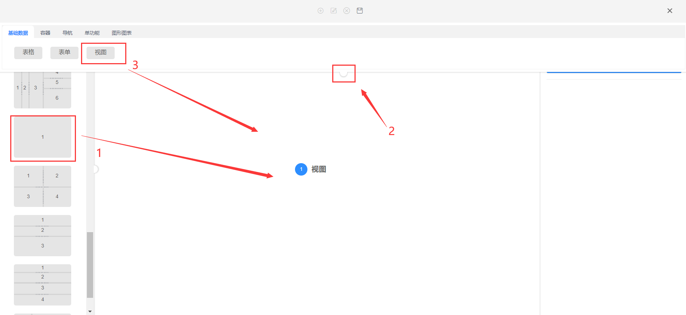

### 表格配置  


#### 功能说明  

>表格是展示基础数据的重要功能组件，您可以根据需求设计表格的样式，配置标题行显示的字段，如“姓名，年龄”等

#### 功能搭建

* 第一步，进入系统管理中的系统功能，点新建功能或右键点击新增功能，开始配置表格页面。

.png ':size=70%')
.png ':size=70%')

* 第二步，根据实际需求拖拽模板到中间区域，点中间的下拉栏，选中基础数据中表格下拉。


>1. 拉取左侧模板，如果模板列表没有想要的模板可以新建一个自定义模板，参考<a href="#/Functional_building/Template">模板配置</a>   
>2. 点击下拉栏，查看各类型功能组件  
>3. 选择基础数据类，拖拽表格组件到中间区域  

* 第三步，在模板任意空白处点击后根据配置提示，进行相关配置维护。


>1. 点击任意空白位置关闭下拉栏
>2. 一定要勾选主功能，方可选菜单

  
* 第四步，根据实际需求选填组件明细内容（需要注意功能名要提前规划好用英文填写，因为涉及表名）。

  

>1. 点击图标弹出国际化语言弹窗  
>2. 关键字部分需要严格使用英文填写，且不能为大写，不能与其他功能名重复只有填写完关键字部分，才能填写下方内容  
>3. 分别填写简体、繁体、英文功能名
>4. 点击保存，功能名配置完毕

* 第五步,根据需求配置组件功能相关的工具栏，自定义按钮功能，选单配置，事件设定等功能,详细配置请参考<a href="#/Functional_building/Detail">详细配置</a>栏    


* 第六步，根据业务需求选择字段，注意配置完功能名后方可选取字段。


>1. 配置完功能名后可点击选取，弹出字段库查询组件

>2. 可以搜索关键字查找要选取的字段，如果没有想要的字段，可以点击新增添加新的字段

>3. 选中字段，可选中多个，如果单个字段双击即可选入

>4. 点击确定，字段选取成功

>5. 可调整字段顺序，或者删除字段
  

* 详细字段设置根据业务需求进行设置，可参考<a href="#/Functional_building/Detail">详细配置</a>栏   

* 第七步，确定导航和分组，配置选择导航和选择分组后，点保存按钮，ctrl+F5刷新系统，功能生效。（刷新ctrl+F5）


>1. 保存功能配置
>2. 选择该功能配置归属导航菜单和分组
  
  
### 表单配置  

#### 功能说明  
>表单负责在页面中收集数据，您可以根据需求设计表单的样式，配置表单收集数据的字段，如“手机号，单号”等

#### 功能搭建

* 第一步，进入系统管理中的系统功能，点新建功能或右键点击新增功能，开始配置表单页面。

.png  ':size=70%')
.png  ':size=70%')  

* 第二步，根据实际需求点击鼠标拖出左侧示例图（如下图），点中间的下拉栏，选中基础数据中表单下拉。


>1. 拉取左侧模板，如果模板列表没有想要的模板可以新建一个自定义模板，参考<a href="#/Functional_building/Template">模板配置</a>   
>2. 点击下拉栏，查看各类型功能组件  
>3. 选择基础数据类，拖拽表单组件到中间区域  

* 第三步，在模板任意空白处点击后根据配置提示，进行相关配置维护。


>1. 点击任意空白位置关闭下拉栏
>2. 一定要勾选主功能，方可选菜单

* 第四步，根据实际需求选填组件明细内容（需要注意功能名要提前规划好用英文填写，因为涉及表名）。

  

>1. 点击图标弹出国际化语言弹窗  
>2. 关键字部分需要严格使用英文填写，且不能为大写，不能与其他功能名重复只有填写完关键字部分，才能填写下方内容  
>3. 分别填写简体、繁体、英文功能名
>4. 点击保存，功能名配置完毕

* 第五步,根据需求配置组件功能相关的工具栏，自定义按钮功能，选单配置，事件设定等功能。详细配置请参考<a href="#/Functional_building/Detail">详细配置</a>栏  

  
  


* 第六步，根据业务需求选择字段。


  
  

>1. 配置完功能名后可点击选取，弹出字段库查询组件

>2. 可以搜索关键字查找要选取的字段，如果没有想要的字段，可以点击新增添加新的字段

>3. 选中字段，可选中多个，如果单个字段双击即可选入

>4. 点击确定，字段选取成功

>5. 可调整字段顺序，或者删除字段
  

* 详细字段设置根据业务需求进行设置，可参考<a href="#/Functional_building/Detail">详细配置</a>栏   


* 第七步，确定导航和分组，配置选择导航和选择分组后，点保存按钮，ctrl+F5刷新系统，功能生效。


>1. 选择该功能配置归属导航菜单和分组
>2. 保存功能配置


### 视图配置   

#### 功能说明  

> 如果您想要在数据库中新建一张表，然后将表格呈现在系统中，您可以使用视图组件配置与数据库表格相同的表名，然后同步字段，这样就可以在系统中查看这张表。

#### 功能搭建

* 第一步,进入数据库，根据需求在数据库中新建一张表。


```text
数据库表必须有id、 _file_info_id、 _sort_ 、title这四个字段
```

* 第二步,进入系统，点击系统管理，进入系统功能界面。

.png ':size=70%')

* 第三步，点新建功能或右键选择新建功能，开始配置视图页面。

.png ':size=70%')

  

* 第四步，先选择左侧样式，将样式拖至中间，然后将基础数据中的视图拖至中间，再点任意空白位置回弹窗口。



>1. 拉取左侧模板，如果模板列表没有想要的模板可以新建一个自定义模板，参考<a href="#/Functional_building/Template">模板配置</a>   
>2. 点击下拉栏，查看各类型功能组件  
>3. 选择基础数据类，拖拽视图组件到中间区域  

* 第五步，点击任意空白位置关闭下拉栏，右侧勾选主功能，勾选主功能后方可选取菜单

.jpg ':size=70%')


  
* 第六步，根据实际需求选填组件明细内容（需要注意功能名要提前规划好用英文填写，因为涉及表名）
  


>1. 点击图标弹出国际化语言弹窗  
>2. 关键字部分需要严格使用英文填写，且不能为大写，不能与其他功能名重复只有填写完关键字部分，才能填写下方内容,关键字名要和数据库名保持一致  
>3. 分别填写简体、繁体、英文功能名
>4. 点击保存，功能名配置完毕

* 第七步,根据需求配置组件功能相关的工具栏，自定义按钮功能，选单配置，事件设定等功能。详细配置请参考<a href="#/Functional_building/Detail">详细配置</a>栏  
  
* 第八步,点击同步字段，自动同步数据库中对应表的字段
  
  

>详细字段设置根据业务需求进行设置，可参考<a href="#/Functional_building/Detail">详细配置</a>栏   

* 第八步,确定导航和分组，配置选择导航和选择分组后，点保存按钮，ctrl+F5刷新系统，功能生效。
    


>1. 选择该功能配置归属导航菜单和分组
>2. 保存功能配置 

* 第九步，进入视图功能组件，查看表格数据，注意无法对表格数据进行修改操作 
  


>1. 无法对表格数据进行修改操作  

>2. 可以对表格进行搜索，筛选

>3. 表格数据是数据库新建表的数据