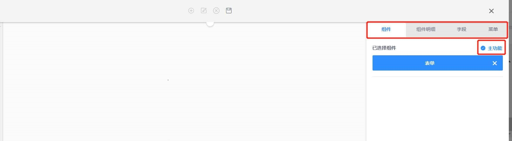

### 表格配置  

#### 功能说明  

>表格是展示基础数据的重要功能组件，您可以根据需求设计表格的样式，配置标题行显示的字段，如“姓名，年龄”等

#### 功能搭建

* 第一步，进入系统管理中的系统功能，点新建功能或右键点击新增功能，开始配置表格页面。

.png ':size=70%')
.png ':size=70%')

* 第二步，根据实际需求拖拽模板到中间区域，点中间的下拉栏，选中基础数据中表格下拉。

>1. 拉取左侧模板，如果模板列表没有想要的模板可以新建一个自定义模板，参考<a href="#/Functional_building/Template">模板配置</a>   
>2. 点击下拉栏，查看各类型功能组件  
>3. 选择基础数据类，拖拽表格组件到中间区域  

* 第三步，在模板任意空白处点击后根据配置提示，进行相关配置维护。

>1. 点击任意空白位置关闭下拉栏
>2. 一定要勾选主功能，方可选菜单

  
* 第四步，根据实际需求选填组件明细内容（需要注意功能名要提前规划好用英文填写，因为涉及表名）。

  

>1. 点击弹出国际化语言弹窗  
>2. 关键字部分需要严格使用英文填写，且不能为大写，不能与其他功能名重复只有填写完关键字部分，才能填写下方内容  
>3. 分别填写简体、繁体、英文功能名
>4. 点击保存，功能名配置完毕

* 第五步,根据需求配置组件功能相关的工具栏，自定义按钮功能，选单配置，事件设定等功能。详细配置请参考<a href="#/Functional_building/Detail">详细配置</a>栏   

  
  
  
  
* 第六步，根据业务需求选择字段。

  * 根据配置需求，选择字段的数据类型

  

>1. 点击选取弹出字段库

>2. 可以搜索关键字查找要选取的字段

>3. 勾选点击确定即可，如果单个字段双击即可选入

  

  * 详细设置根据业务需求进行设置

.png ':class=lozad')
.png ':class=lozad')
.png ':class=lozad')

>1. 勾选设置字段的直接属性

>2. 编辑字段默认值，可以是文本如果是子查询项目可写入子查询的值

>3. 可根据客户使用习惯将字段别名显示

>4. 字段在表内的宽度

>5. 例如数量字段，在表低求和

>6. 勾选字段可调整字段顺序

>7. 该字段的值来与其他表格内的字段可选择对应表的对应字段，例如业务表引入产品表的产品编码

>8. 通过固定的字段附加列表设定下拉项并与此表做关联，例如单据类型，简单辅助属性

>9. 表内带有公式字段需打开公式触发开关

>10. 通过选入某一字段的值而将此值在其他表关联的其他字段引用到这个字段，并且与原表值同步

>11. 设置表内数据过滤规则，例如时间正序倒序

  

* 第七步，确定导航和分组，配置选择导航和选择分组后，点保存按钮，系统再刷新或者退出重新登录，功能生效。（刷新ctrl+F5）

  

>1. 保存功能配置
>2. 选择该功能配置归属导航菜单和分组
  
  
### 表单配置  

#### 功能说明  
>**表单负责在页面中收集数据，您可以根据需求设计表单的样式，配置表单收集数据的字段，如“手机号，单号”等**

#### 功能搭建

* 第一步，进入系统管理中的系统功能，点新建功能或右键点击新增功能，开始配置表单页面。

.png ':class=lazyload')
.png ':class=lazyload')  

* 第二步，根据实际需求点击鼠标拖出左侧示例图（如下图），点中间的下拉栏，选中基础数据中表单下拉。

  

* 第三步，在模板任意空白处点击后根据配置提示，进行相关配置维护。

  
> **注：**一定要勾选主功能，方可选菜单

* 第四步，根据实际需求选填组件明细内容（需要注意功能名要提前规划好用英文填写，因为涉及表名）。

  

* 第五步,根据需求配置组件功能相关的工具栏，自定义按钮功能，选单配置，事件设定等功能。

  
  
> 该区域是单个表单组件进行配置。配置工具栏的功能，自定义按钮功能，表单联查设置，选单配置，事件设定等功能。

* 第六步，根据业务需求选择字段。

  * 根据配置需求，选择字段的数据类型

  
  

>1. 点击选取弹出字段库

>2. 可以搜索关键字查找要选取的字段

>3. 勾选点击确定即可，如果单个字段双击即可选入

  

  * 详细设置根据业务需求进行设置

.png ':class=lazyload')
.png ':class=lazyload')
.png ':class=lazyload')

>1. 勾选设置字段的直接属性

>2. 编辑字段默认值，可以是文本如果是子查询项目可写入子查询的值

>3. 可根据客户使用习惯将字段别名显示

>4. 字段在表内的宽度

>5. 例如数量字段，在表低求和

>6. 勾选字段可调整字段顺序

>7. 该字段的值来与其他表格内的字段可选择对应表的对应字段，例如业务表引入产品表的产品编码

>8. 通过固定的字段附加列表设定下拉项并与此表做关联，例如单据类型，简单辅助属性

>9. 表内带有公式字段需打开公式触发开关

>10. 通过选入某一字段的值而将此值在其他表关联的其他字段引用到这个字段，并且与原表值同步

>11. 设置表内数据过滤规则，例如时间正序倒序

  

* 第七步，确定导航和分组，配置选择导航和选择分组后，点保存按钮，系统再刷新或者退出重新登录，功能生效。（刷新ctrl+F5）

  

>1. 选择该功能配置归属导航菜单和分组
>2. 保存功能配置

### 视图配置   

#### 功能说明  

> **如果您想要在数据库中新建一张表，然后将表格呈现在系统中，您可以使用视图组件配置与数据库表格相同的表名，然后同步字段，这样就可以在系统中查看这张表。**  

#### 功能搭建

* 第一步,进入数据库，根据需求在数据库中新建一张表。

>数据库表名对应视图表名

* 第二步,进入系统，点击系统管理，进入系统功能界面。

.png ':class=lazyload')

* 第三步，点新建功能或右键选择新建功能，开始配置视图页面。

  .png ':class=lazyload')

  

* 第四步，先选择左侧样式，将样式拖至中间，然后将基础数据中的视图拖至中间，再点任意空白位置回弹窗口。

  .jpg)

  

* 第五步，右侧勾选主功能，勾选主功能后方可选取菜单

  .jpg)

  
* 第六步，根据实际需求选填组件明细内容（需要注意功能名要提前规划好用英文填写，因为涉及表名）
  

>1. 点击配置国际化功能名  

>2. 功能名要和数据库名保持一致  

  
* 第七步,点击同步字段，自动同步数据库中对应表的字段
  
  

>可根据需求对字段进行相应配置

* 第八步,确定导航和分组，配置选择导航和选择分组后，点保存按钮，系统再刷新或者退出重新登录，功能生效。（刷新ctrl+F5）
    

>1. 选择该功能配置归属导航菜单和分组
>2. 保存功能配置 

* 第九步，进入视图功能组件，查看表格数据，注意无法对表格数据进行修改操作 
  

>1. 无法对表格数据进行修改操作  

>2. 可以对表格进行搜索，筛选

>3. 表格数据是数据库新建表的数据