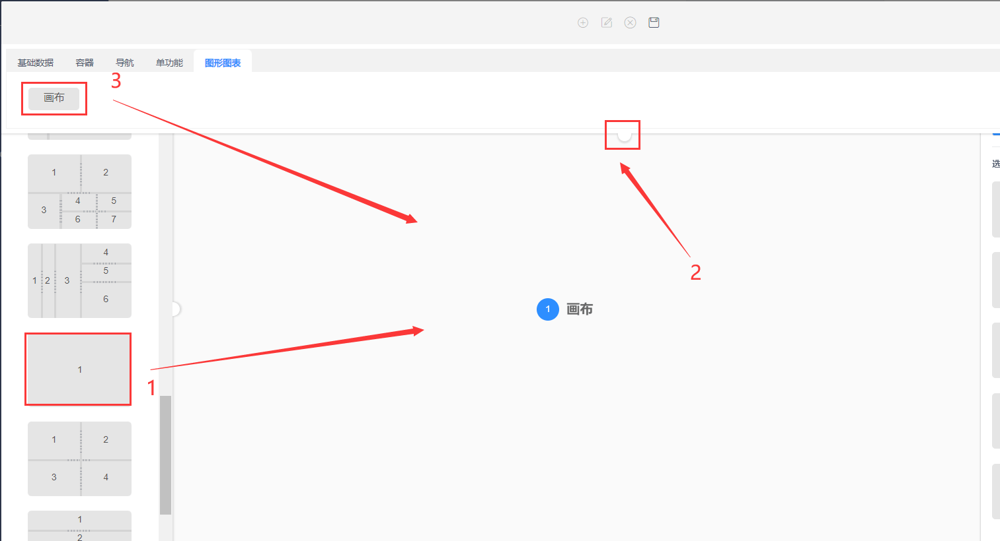
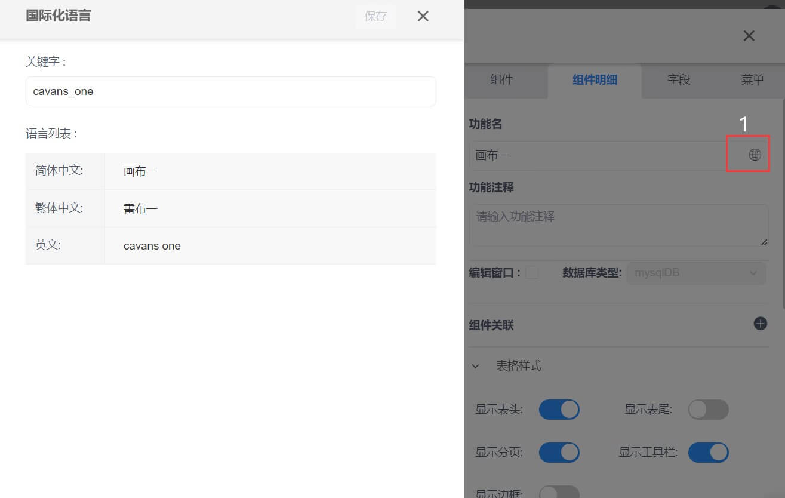
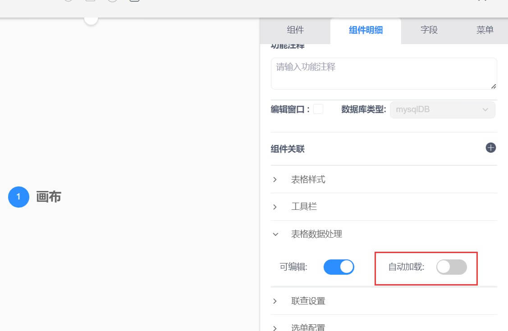
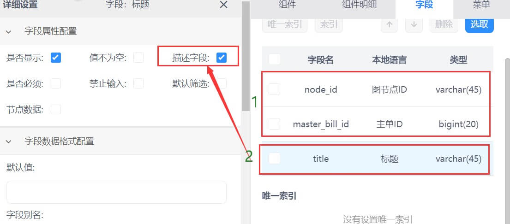

### 画布配置  

#### 功能说明  

>**如果您想更直观的表达业务的处理过程，可以配置画布组件，实现数据可视化。**  

#### 功能搭建

* 第一步,点击系统管理，进入系统功能界面。

.png)

* 第二步，点新建功能或右键选择新建功能，开始配置画布页面。

  .png)

  

* 第三步，先选择左侧样式，将样式拖至中间，然后将图形图表中的画布拖至中间，再点任意空白位置回弹窗口。

  

  

* 第四步，右侧勾选主功能，根据实际需求选填组件明细内容（需要注意功能名要提前规划好用英文填写，因为涉及表名）

  

>1. 点击配置国际化功能名
  
* 第五步，画布的组件明细设置，一定要把自动加载关闭。
  

* 第六步，根据需求选择相应的字段和规则。

* 
  
>1. 系统自动生成画布的字段  

>2. 选择标题字段作为描述字段  

* 第七步,确定导航和分组，配置选择导航和选择分组后，点保存按钮，系统再刷新或者退出重新登录，功能生效。（刷新ctrl+F5）
    

>1. 选择该功能配置归属导航菜单和分组
>2. 保存功能配置