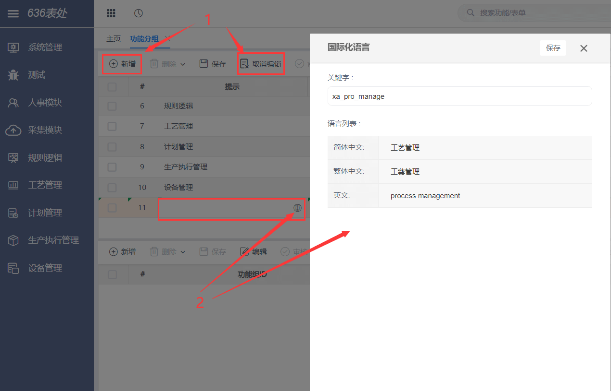

* 第一步，进入系统开启导航功能，打开左边侧系统管理，再点功能分组后，开始新建主配置栏目功能表。

  .png)

  

* 第二步，进入新建页面先点新增，后点编辑。

  .png)

* 第三步，进入新增页面，需要根据提示规范填写（开头原文填写英文、简体中文、繁体中文、英文）依次按顺便规范填写。

  

* 第四步，点击新建好的功能然后下表体点击新增，注意点击小地球图标填入中英文国际化，编辑功能分组名称后点击保存，点击保存后，再点击上表体的功能名后点击下标题的新增，编辑分组名称，可多行。

  .png)

* 更改后效果见下图  
.png)  
注：新建功能分组后，如果该分组下没有任何功能界面，导航不显示