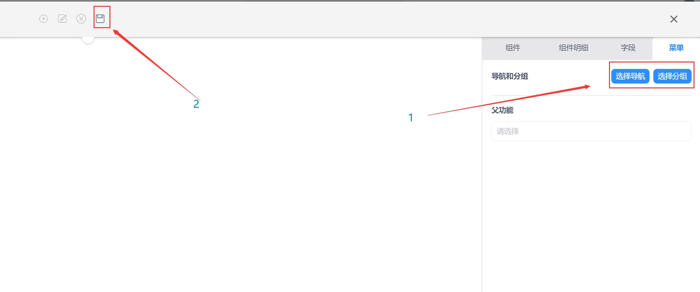

### 单据配置  

#### 功能说明  

>**单据是表单与表格的组合功能组件，可以制作标准单据，并提供打印功能，您可以根据需求制作“销售单，采购单”等。**  

#### 功能搭建

* 第一步,选择模板并拖拉至配置器中间，拖拉组件单据，左手边开始配置。

  

  

* 第二步，在模板任意空白处点击，出现右边功能配置明细，进行相关配置维护。

  
> **注：**一定要勾选主功能，方可选菜单

  

* 第三步，根据需求选择组件明细，需要注意，功能名要提前规划好用英文填写，因为涉及表名。

.png  ':class=lazyload')
.png  ':class=lazyload')
.png  ':class=lazyload')

>1. 勾选设置字段的直接属性

>2. 编辑字段默认值，可以是文本如果是子查询项目可写入子查询的值

>3. 可根据客户使用习惯将字段别名显示

>4. 字段在表内的宽度

>5. 例如数量字段，在表低求和

>6. 勾选字段可调整字段顺序

>7. 该字段的值来与其他表格内的字段可选择对应表的对应字段，例如业务表引入产品表的产品编码

>8. 通过固定的字段附加列表设定下拉项并与此表做关联，例如单据类型，简单辅助属性

>9. 表内带有公式字段需打开公式触发开关

>10. 通过选入某一字段的值而将此值在其他表关联的其他字段引用到这个字段，并且与原表值同步

>11. 设置表内数据过滤规则，例如时间正序倒序

  

* 第四步，根据需求配置组件功能相关的工具栏，自定义按钮功能，选单配置，事件设定等功能。

  

  >5. 该区域是单个表单组件进行配置。配置工具栏的功能，自定义按钮功能，表单联查设置，选单配置，事件设定等功能。

* 第五步，根据配置需求选择字段。

  * 表头

  <!--  -->

  * 规则和表头设置

  

>1. 这里可以根据需求设置特定字段的规则

>2. 这里可以根据需求进行分组和表的设置
  

  

* 第六步，确定导航和分组，配置选择导航和选择分组后，点保存按钮，系统再刷新或者退出重新登录，功能生效。（刷新ctrl+F5）
    

>1. 保存功能配置
>2. 选择该功能配置归属导航菜单和分组
  
  
  
  

 

