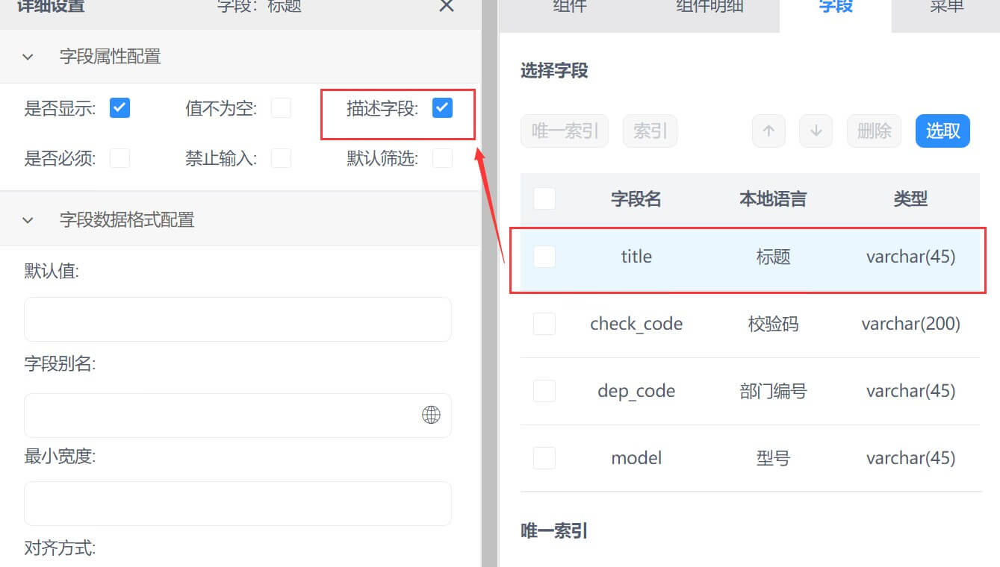

### 标签页配置  

#### 功能说明  

>**通过使用标签页，您同时浏览多个页面，并轻松在这些标签页之间切换，无需打开多个窗口。**

#### 功能搭建

* 第一步,进入系统管理中的系统功能，点新建功能，开始配置表格页面。

.png ':class=lazyload')

* 第二步，点新建功能，开始配置页签页面。

  .png ':class=lazyload')

  

* 第三步，先选择左侧样式，将样式拖至中间，后选中标签页拖至模板设计中间，再点中间小圆点回弹窗口。

  

  

* 第四步，更改标签名，如果有标签选择再点+新增，所需配置组件，同样右侧拉取模板，顶部拉取组件，进行配置。

  

  

* 第五步，如该标签页属于主功能，则需要勾选主功能后，方可选择菜单栏。

  

  

* 第六步，根据需求选择组件明细，需要注意，功能名要提前规划好用英文填写，因为涉及表名。

.png ':class=lazyload')
.png ':class=lazyload')
.png ':class=lazyload')

>1. 勾选设置字段的直接属性

>2. 编辑字段默认值，可以是文本如果是子查询项目可写入子查询的值

>3. 可根据客户使用习惯将字段别名显示

>4. 字段在表内的宽度

>5. 例如数量字段，在表低求和

>6. 勾选字段可调整字段顺序

>7. 该字段的值来与其他表格内的字段可选择对应表的对应字段，例如业务表引入产品表的产品编码

>8. 通过固定的字段附加列表设定下拉项并与此表做关联，例如单据类型，简单辅助属性

>9. 表内带有公式字段需打开公式触发开关

>10. 通过选入某一字段的值而将此值在其他表关联的其他字段引用到这个字段，并且与原表值同步

>11. 设置表内数据过滤规则，例如时间正序倒序

  

* 第七步，根据需求配置组件功能相关的工具栏，自定义按钮功能，选单配置，事件设定等功能。

  

>5. 该区域是单个表单组件进行配置。配置工具栏的功能，自定义按钮功能，表单联查设置，选单配置，事件设定等功能。
  

* 第八步，根据需求选择相应的字段和规则。

* 

* 第九步,确定导航和分组，配置选择导航和选择分组后，点保存按钮，系统再刷新或者退出重新登录，功能生效。（刷新ctrl+F5）
    

>1. 选择该功能配置归属导航菜单和分组
>2. 保存功能配置

### 引用组件配置  

#### 功能说明  

>**如果您需要一条数据关联一张表格，而这个表格已经搭建完毕，有完整的工具栏和标题字段，您可以使用引用组件将该表格引用并关联，无需重新配置关联表格。**   

#### 功能搭建

* 第一步，根据实际需求点击鼠标拖出左侧模板，点中间的下拉栏，选中容器中引用组件下拉。

注：引入组件不可作为主功能存在，本例中使用①表格作为主功能  
* 第二步，在①表格中配置组件关联时关联引用组件，并手动输入关联表的关联id  
  
  

>1. 组件关联需在父组件中进行关联，此处①表格关联②引用组件  

>2. id为①表格的自身id  

>3. 无法选择目标字段，需手动输入目标字段  

* 第三步，①表字段配置时，选取标题字段作为描述字段 
  

* 第四步，①表配置完毕，点击②引用组件进行配置，在引用功能中添加需要引用的功能组件，可添加多个  

     
 
 
>1. 进入②引用组件功能配置 

>2. 功能名自动添加，无需手动添加   

>3. 引用功能配置需要关联的功能组件  

>4. 点击添加功能组件，可添加多个  

>5. 点击搜索需要关联功能组件，双击选入  

>6. 点击删除功能组件  

* 第五步，点击保存后Ctrl+F5刷新，进入系统功能界面找到关联功能组件，然后右键选择修改功能  
  
>1. 在系统管理导航页面找到系统功能点击进入  

>2. 搜索关联功能组件   

>3. 引用功能配置需要关联的功能组件    

>4. 点击选中关联组件  

>5. 右键单击修改功能  

* 第六步，在多对一中选取我们保存的引用组件
  

>1. 检查关联功能组件是否有关联id，若没有，选取master_bill_id主单id  

>2. 选取保存的引用组件  

* 第七步，点击保存后Ctrl+F5刷新，进入我们的引入功能组件，上表的标题对应下表的主单id，实现一条数据对应多个现有功能组件  
 

>1. 此时表中无数据，点击新增添加数据  

>2. 上表的第一条数据对应下表