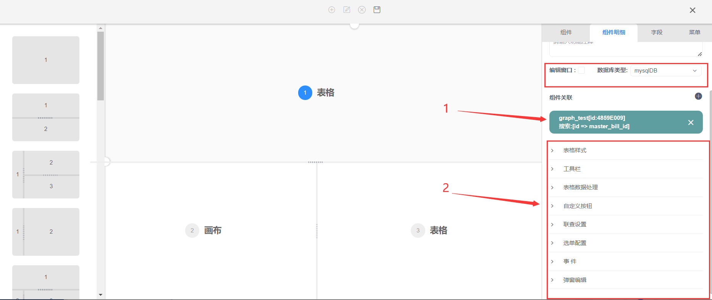

<!-- ### 功能配置说明

功能就是导航菜单，可以把新建的功能程式放在对应的导航菜单下展示。 -->
<!-- 
### 功能配置操作

#### 一、导航菜单 -->
### 功能配置操作流程  

 

 详细操作如下  

* 第一步，进入系统开启导航功能，打开左边侧系统管理，再点功能分组后，开始新建主配置栏目功能表。

  .png)

  

* 第二步，进入新建页面先点新增，后点编辑。

  .png)

* 第三步，进入新增页面，需要根据提示规范填写（开头原文填写英文、简体中文、繁体中文、英文）依次按顺便规范填写。

  

* 第四步，点击新建好的功能然后下表体点击新增，注意点击小地球图标填入中英文国际化，编辑功能分组名称后点击保存，点击保存后，再点击上表体的功能名后点击下标题的新增，编辑分组名称，可多行。

  .png)

* 更改后效果见下图  
.png)  
注：新建功能分组后，如果该分组下没有任何功能界面，导航不显示

* 第五步、系统管理模块下进入系统功能界面，点击**新增功能**或**右键点击新增功能**，弹出设置编辑界面
  
.png)

* 第六步 在弹出设置界面内将左侧功能布局模板直接拖拽至功能编辑区

.png)
>1.工具

>2.功能类型

>3.功能实现区域：将适用的功能布局模板直接拖拽至该区域

>4.布局模板区

* 第七步，将功能类型拖拽至对应的应用区域；如下图例第一区域为表结构，第二个区域画布结构，第三个区域为表结构，点击不同区域右侧显示该区域的编辑设置菜单；

.png)

* 第八步，编辑①表内容：点击①表格，在右侧菜单种组件菜单将此表勾选设置为主功能；

>1.点击对应的功能区域表，右侧是对应设置该表的组件，组件明细，字段，和菜单分类

>2.确定主表，并将主表设置为主功能

* 第九步，在右侧菜单组件明细下设置表名（存在数据库的表名需按照开发表名规范命名；

* 第十步，组件明细菜单下方组件关联区域，通过下拉选择建立针对这三个表或者画布的关联关系（后面操作会详细说明），下方的折叠菜单为功能开关（增删改查审等），事件（存储过程引用）
  

>1. 选择表的数据库类型，默认mysqlDB

>2. 下方选择此表的功能开关，对应调用的存储过程

* 第十一步，字段菜单，选择①表格内要包含的字段，点击选取弹出字段库可在字段库将字段选入

>1. 点击选取弹出字段库

>2. 可以搜索关键字查找要选取的字段

>3. 勾选点击确定即可，如果单个字段双击即可选入

* 第十二步，选入字段后，可点击字段进行字段的详细设置，主表的ID不显示
.png)
.png)
.png)

>1. 勾选设置字段的直接属性

>2. 编辑字段默认值，可以是文本如果是子查询项目可写入子查询的值

>3. 可根据客户使用习惯将字段别名显示

>4. 字段在表内的宽度

>5. 例如数量字段，在表低求和

>6. 勾选字段可调整字段顺序

>7. 该字段的值来与其他表格内的字段可选择对应表的对应字段，例如业务表引入产品表的产品编码

>8. 通过固定的字段附加列表设定下拉项并与此表做关联，例如单据类型，简单辅助属性

>9. 表内带有公式字段需打开公式触发开关

>10. 通过选入某一字段的值而将此值在其他表关联的其他字段引用到这个字段，并且与原表值同步

>11. 设置表内数据过滤规则，例如时间正序倒序

* 第十三步，组件关联，需要在主表设置从属关系，例如下图，①表是主表，②画布是从表，①表的不同行数据对应②画布的不同图形。
.png)

>1. 点击新增增加组件关联，可多个关联

>2. 下拉选择通过ID关联②画布的master_bill_id,业务说明：①表的不同行对应②画布的不同内容

>**注** ：（1）带画布的功能，系统自动生成画布的字段
>.png)  
>（2）画布的组件明细设置，一定要把自动加载关闭   
> (3)③表关联了行数据②画布的节点ID   
>（4）手动关闭  
>.png)  
>（5）③表组件明细种，也要将自动加载关闭  
>  
>在点击①表的菜单工具，选择主功能菜单，选择将搭建功能放在哪个模块下，在选择模块下的分组菜单  
>（6）选择主功能菜单  
>（7）选择菜单下的分组  
>  
> 功能搭建完成刷新页面，在菜单找到该功能打开，以测试主表功能为例  
> （8）点击第一行显示下图  
> （9）点击测试二图形显示右侧数据  
> .png)  